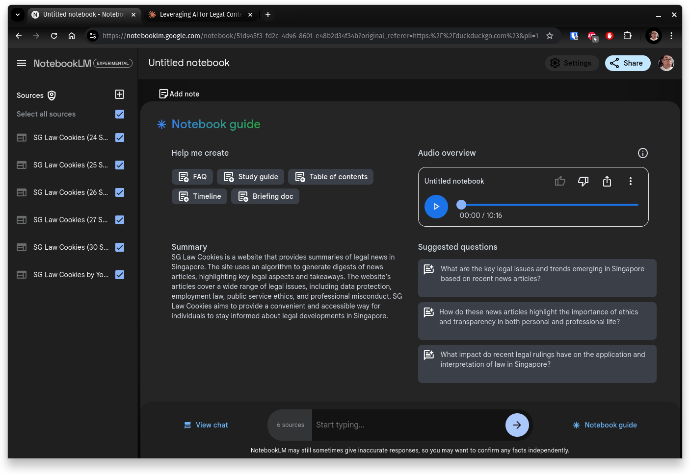

+++ 
draft = true
date = 2024-10-02T09:37:39+08:00
title = "AI-Generated Legal Podcasts: A Deep Dive into NotebookLM"
description = "Explore the intersection of legal tech and artificial intelligence as I experiment with Google's NotebookLM to create AI-generated legal podcasts. Discover the challenges and potential of using AI for podcast creation in the legal field."
slug = "ai-generated-legal-podcasts"
tags = ["AI", "LegalTech", "Podcast Creation", "Google NotebookLM", "AI-Generated Content", "Software Engineering", "Legal News"]
categories = []
+++
As a lawyer with some interest in software engineering, I've always been fascinated by the intersection of legal tech and artificial intelligence. The recent buzz around AI-generated content caught my attention, particularly in the realm of podcast creation. In this post, I'll share my experience experimenting with Google's NotebookLM, using my legal news platform, [SG Law Cookies](https://cookies.your-amicus.app), as a test case for AI-generated legal podcasts.

## The Challenges of AI-Generated Podcasts

Creating AI-generated podcasts is more complex than simply converting text to speech. Here are some key challenges:

1. **Summarizing and Structuring Content**: Transforming multiple text sources into a coherent narrative.
2. **Natural-Sounding Speech**: Producing engaging speech patterns that maintain listener interest.
3. **Conveying Meaning Through Voice**: Implementing appropriate stress and intonation in synthesized speech.
4. **Smart Content Selection**: Identifying and prioritizing the most relevant information across multiple sources.
5. **Understanding Legal Language**: Accurately interpreting and conveying complex legal terminology and concepts.

## NotebookLM: A User-Friendly AI Tool

[NotebookLM](https://notebooklm.google.com/) is Google's experimental AI notebook that leverages advanced language models for various text processing tasks. Let's take a look at its interface:

*NotebookLM interface showcasing source management, content generation, and audio synthesis capabilities*

Key features of NotebookLM:

1. **Source Management**: Efficiently organizes and retrieves input documents.
2. **Content Generation**: Creates new text based on the input sources.
3. **Audio Synthesis**: Converts generated text into speech.
4. **Query Understanding**: Generates relevant responses to user questions about the content.

## My Experiment

I fed one week of legal news summaries from SG Law Cookies (about 35 articles) into NotebookLM and asked it to generate a 10-minute podcast summarizing key legal developments.

## Listen and Provide Feedback

I've made the AI-generated podcast available for you to listen and evaluate.



I encourage fellow legal professionals and tech enthusiasts to listen and consider:
1. How well does it summarize the week's legal news?
2. Is the content organized logically and coherently?
3. How accurate is the legal information presented?
4. How does the listening experience compare to human-hosted legal podcasts?

Your insights will be invaluable in understanding the potential and limitations of this technology in legal practice.

## What Worked Well

1. **Ease of Use**: NotebookLM required minimal guidance beyond the source text, making it user-friendly for non-technical users.
2. **Effective Summarization**: The system successfully condensed a week's worth of legal news into a coherent 10-minute script.
3. **Handling Legal Terminology**: Despite no specific legal training, the AI accurately handled most legal terms.

## Areas for Improvement

1. **Thematic Organization**: The day-by-day processing approach led to a somewhat disjointed narrative. A more sophisticated topic identification system could improve content structuring.
2. **Natural-Sounding Speech**: While intelligible, the synthesized speech lacked the natural flow of human speakers. More advanced voice synthesis techniques could enhance the listening experience.
3. **Content Prioritization**: The current system seemed to weigh all input equally, occasionally including less significant news items. Implementing a smarter relevance scoring system could improve content selection.

## Potential Enhancements

1. **Better Topic Identification**: Implement algorithms to identify overarching themes across multiple documents, improving thematic coherence.
2. **More Engaging Narration**: Train the language model to generate more natural-sounding narratives, possibly by learning from human-created legal podcasts.
3. **Improved Legal Entity Recognition**: Enhance the system's ability to identify and correctly handle mentions of legal entities, case names, and statutes.
4. **Custom Voice Model for Legal Content**: Develop a specialized voice model that better captures the typical rhythms and intonations of legal discourse.
5. **Smarter Question Generation**: Improve the system's ability to generate insightful questions about the content, enhancing its interactive capabilities.

## Potential Applications in Legal Practice

The capabilities demonstrated by NotebookLM open up several exciting possibilities:

1. **Automated Case Law Summaries**: Generating concise audio briefs of lengthy court decisions.
2. **Interactive Legal Research Assistants**: Creating conversational interfaces for legal databases.
3. **Personalized Legal News Feeds**: Tailoring content to individual lawyers' practice areas and interests.
4. **Continuing Legal Education (CLE) Content**: Automatically generating educational content from recent legal developments.

## The Prompt Engineering Challenge

While NotebookLM's capabilities are impressive, I'm considering whether I can replicate its functionality using prompt engineering with other large language models. This presents several challenges:

1. **Guessing the Prompt**: NotebookLM's underlying prompts are not visible to users. Recreating its functionality would require significant experimentation to craft prompts that yield similar results.
2. **Handling Multiple Sources**: NotebookLM efficiently processes multiple documents. Replicating this in a single prompt while maintaining coherence could be tricky.
3. **Maintaining Context**: Ensuring the AI maintains context across long-form content generation is a common challenge in prompt engineering.
4. **Balancing Detail and Conciseness**: Crafting prompts that encourage both comprehensive coverage and concise summarization is a delicate balance.
5. **Incorporating Audio Generation**: While text generation can be achieved through prompt engineering, integrating text-to-speech functionality would require additional tools or APIs.

These challenges highlight the sophistication of NotebookLM's approach. As Simon Willison notes, "NotebookLM is effectively an end-user customizable RAG product" [^1], suggesting that it's doing more behind the scenes than simple prompt-response interactions.

[^1]: Willison, S. (2024, September 29). NotebookLM audio overviews. Simon Willison's Weblog. https://simonwillison.net/2024/Sep/29/notebooklm-audio-overview/

## Conclusion and Future Outlook

While NotebookLM shows promise in automating legal content creation, there's still room for improvement to achieve human-level quality. Future developments might include:

1. Training AI models on extensive legal databases to improve understanding of legal concepts.
2. Developing more sophisticated content structuring algorithms.
3. Improving speech synthesis to better capture the nuances of legal discourse.
4. Implementing robust fact-checking mechanisms to ensure the accuracy of generated content.

As we continue to explore AI in legal tech, tools like NotebookLM offer a glimpse into a future where AI significantly augments legal research and content creation. The excitement around these tools is palpable, with legal tech commentators like Dazza Greenwood also experimenting with NotebookLM [^2], demonstrating the legal community's growing interest in AI-powered solutions.

[^2]: Greenwood, D. (2024). [LinkedIn Post]. LinkedIn. https://www.linkedin.com/posts/dazzagreenwood_leaping-the-uncanny-valley-activity-7246745547334713344-hGte

