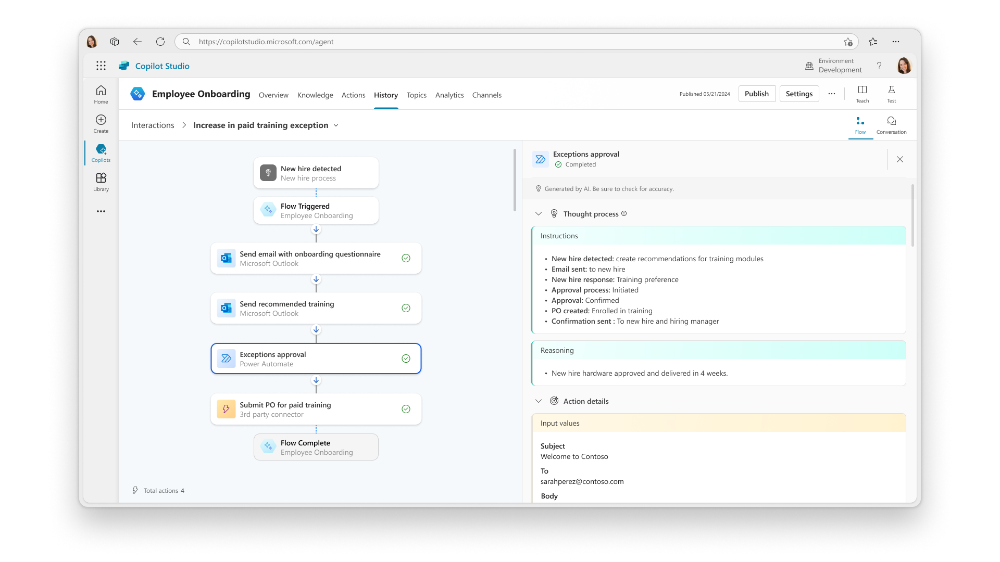
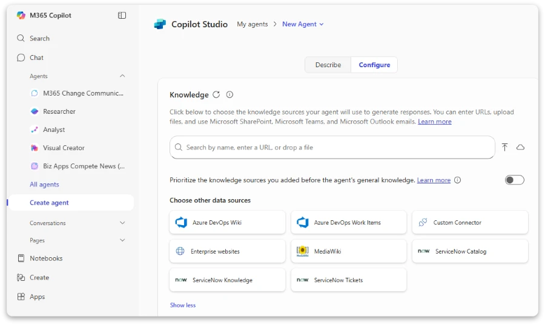

+++ 
draft = false
date = 2025-09-06T06:33:09+09:00
title = "Discovering Microsoft Copilot Studio as the No-Code Tool I've Been Waiting For"
description = "Reflections on meeting colleagues in Japan who are embracing Microsoft Copilot Studio, and why this might finally be the no-code solution that delivers on its promises for AI agents and end users."
slug = "japan-trip-copilot-studio-no-code"
authors = ["Ang Hou Fu"]
tags = ["no-code", "microsoft", "copilot-studio", "ai", "japan", "business-travel", "automation"]
categories = ["Technology", "Work", "AI"]
externalLink = ""
series = []
+++

I just returned from a fascinating business trip to Japan, where I had the opportunity to reconnect with colleagues and observe how they're approaching the latest wave of AI tools. What struck me most was how many of them have started adopting Microsoft Copilot Studio—and after experimenting with it myself, I think this might finally be the "no-code" tool I've been waiting for.

## It's all in the past

I was a bit apprehensive about going on the trip at first. As a tech evangelist in the legal department, I was supposed to show how I use AI in my daily work to inspire my colleagues. 

The problem was that the tool I felt most excited to share about was something I only discovered less than a month ago and only really by chance. 

You see, I am a long time Microsoft Copilot user. I was sold on the promise that Copilot would bring the magic of Generative AI to the old world of Microsoft Office. The reality fell short of expectations.[^1] 

Being ahead of the curve, I was fascinated with the prospect of an AI agent that could access enterprise data. I knew if that I can provide the data and some instructions, I could create something pretty awesome that I could share with my colleagues. This called for **Microsoft Copilot Studio**, a place where I can bring my nascent ideas to reality.

It's "no-code", so like Scratch, Zapier, and n8n, it relies on "building blocks" to create your program. However, I took too long to learn how to make full use of these building blocks. I never even got to troubleshoot or deploy anything. Having a day job made things worse. 

At some point, I told myself, I just wanted "RAG"[^2] -- look at my documents, look at my query and create an answer. I couldn't do it. 

As frontier models marched on in intelligence and capability, Microsoft Copilot Studio faded from my priorities. I stopped recommending it, and focused on how to extract more out of the chatbot interface. 

## Copilot Studio: Checking the No-Code Boxes

However, a training session would completely change my perspective. I attended a basic Microsoft Copilot training session in June, and found that they had revamped the interface. Encouragingly, the new interface allowed you to reference agents: you "@" an agent (other programs, like LM Studio, uses a "/"), and then it becomes part of your chat. One of the agents was "Researcher", aka Deep Search.[^3] I was excited. 

I decided to click around the interface and found out too that they had integrated Studio into the general Copilot interface. 

They've also managed to streamline the process for creating an agent:
1. You can start by describing the agent in a chatbox. I'm skeptical of using a chatbot interface for AI configuration, but I figure as a starting point, it's easier to fill in more blanks using this interface.
2. Leading into the configure tab, you get to name your agent and so on. 
3. There's now an "Instructions" box -- which is something like a system prompt. For something this important, the box is kinda small.
4. You can also configure knowledge source like your Sharepoint documents, or even upload something from your computer.
5. You can draft some starter questions. If you decide to share your agent, these questions make for a good demo. 
6. Update it and then you can share it with your colleagues with a link.
 
### Why This Feels Different

It's easy to understand the allure of "no code". My needs aren't complicated, I don't want to learn how to program, but I want to see _results_.

Once you get to the specifics, it gets harder. I am not talking about the fact that I can usually get the same results by coding[^4], and usually much further.

In "no code", you still have to learn something. You also have to troubleshoot and fix problems in your application. Then you have to deploy it. If you can't get your app out of the door, what's the point right?

The new Microsoft Copilot Studio interface is a great improvement in this regard:
* If you're bothered to create a agent, you are probably already very good at using a chatbot interface and all the problems that come with it.
* As the only real variables in your agent come from the knowledge source (does my agent have enough or the right information?) and the instructions (does it have enough guidance on how to answer?). It is easier to debug the agent.
* If you were able to access Copilot Studio, you probably have Copilot, and so do many of your colleagues. You can click on the share button, which will provide you a link you can share with someone.[^5] 
* As an end user, you also need to create it quickly. If you're mired in complexity or continuously having to contact your IT Department, you're probably better off getting a real developer.

So finally, we have "dumb" RAG. The wonders of technology!

### End User Adoption

So far this is what I have been using it:
* I saved a bunch of policies and created a Chatbot around them. Don't scoff at the intelligence of GPT4 or GPT5. It can take a question as moronic as "I want to buy an iPhone for my business partner" and create a treatise on how it might be against company policy and where you can find the forms to apply for it.
* I provided a form template and ask my agent to fill it up using a provided scenario. It works with uploads too. So I can get the agent to fill up the form for approval using an invoice or contract, and highlighting which fields still need work.[^6]
* Comparing new cases using precedents you saved, you can highlight special points of concern and summarise them for further study.
* Adding all the emails and other documents from a particular matter, you can ask your agent questions, construct timelines and even make quizzes.

As the interface is so easy, it makes sense to just keep creating agents. My colleagues in Japan were already trying to make new agents, and I think this helps them to figure out what kind of use case are most suitable. I've really got to catch up.

This is really an exciting moment!

## Musings on No-Code

I am relieved somebody figured out how to connect enterprise data to an AI without too much complexity. This might be "dumb" RAG but we have a lot to go on. If you have a problem, and you imagine that an AI agent can solve it, there's a good chance you can do it with Copilot Studio. Now that's what no code promised us. What are you going to "agentify" next?

---

*What are your experiences with Microsoft Copilot Studio or other no-code AI tools? I'd love to hear your thoughts.*

[^1]: For context: Copilot integration with Word, Excel, and PowerPoint remains underwhelming in my experience. I expect PowerPoint to provide meaningful suggestions and feedback on presentations, not just summaries. While summarization demonstrates LLM capabilities, it doesn't address the practical workflow improvements I'm looking for.

[^2]: At the time, RAG, or retrieval augmented generation, was the rage. The engineering that goes into figuring how to locate a relevant document and how to create sufficient context to generate an accurate and useful answer is a fascinating science in itself. 

[^3]: Microsoft's inconsistent naming conventions continue to puzzle me. Given their tendency to label everything "Copilot," the decision not to call this feature "Deep Search" seems oddly inconsistent.

[^4]: Investing in learning how to code can offer good returns in this regard. Check out my post on [coding for lawyers](/posts/so-you-want-to-code).

[^5]: It appears, subject to further confirmation, that sharing recreates the agent in the other user's interface, so your other user needs to have the same Copilot Studio and access to similar documents before you can use the agent the same way as you created it. That might make sharing updates slightly complicated too...

[^6]: On security and compliance: Since Copilot Studio operates within your existing Microsoft 365 enterprise environment, it inherits your organization's existing data governance policies and security controls. This means data handling, encryption, and access controls should follow the same enterprise data policies your company already has in place for Microsoft 365, maintaining the separation between enterprise data and external web access that your IT department has established. For legal departments, this is particularly important as it means client confidentiality, attorney-client privilege, and document retention policies should be preserved through your existing Microsoft 365 compliance framework. However, you should still verify with your IT team that audit trails for agent interactions meet your firm's compliance requirements, and consider whether shared agents might inadvertently expose confidential information across different matters or client engagements. The key is that you're not introducing a new security risk - you're operating within the same trusted environment your organization already uses for sensitive business documents.