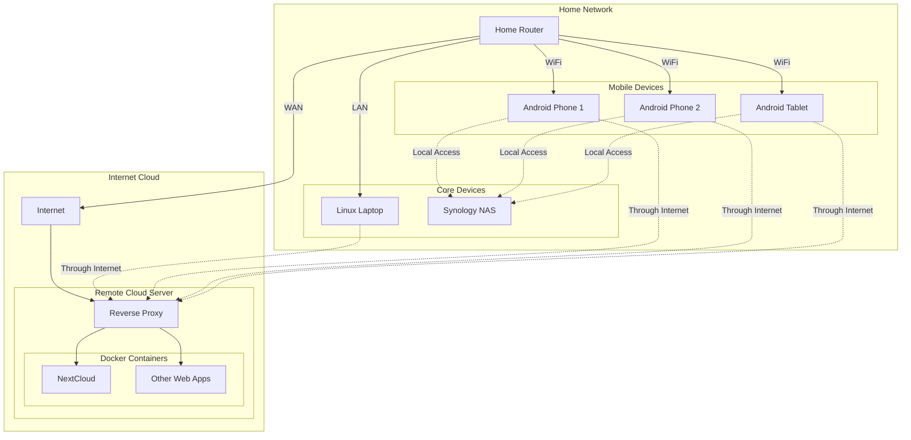

+++ 
date = 2025-08-03T00:20:16+08:00
title = "Trying Tailscale"
description = "How I simplified my home network security with Tailscale - a practical guide for professionals managing multiple devices and cloud services"
slug = "trying-tailscale"
tags = ["Technology", "Legal Tech", "Networking", "Security", "Infrastructure", "Remote Work"]
categories = ["posts"]
+++

## The Problem: Modern Networks Are Messy

I once gave Claude my entire Mastodon posting history and asked it for comments. It said, among others, that there were "Many threads about technical troubleshooting that end unresolved, which may frustrate followers." I read it as "you complain about your networking problems excessively", even on Christmas eve.[^1] 

Managing a home network shouldn't require a computer science degree. Like many tech enthusiasts, I've spent years building and maintaining my home network and it has grown complex since.[^2] Nevertheless, tools have caught up, so here's now I simplified mine with Tailscale.

## My Network evolves

Like many professionals, my setup grew organically:

* Started simple: Basic router + laptops
* Added storage: NAS for file sharing
* Went mobile: Everyone got smartphones and tablets
* Moved to cloud: Web apps via Docker containers
* Hit complexity wall: Multiple access methods, security layers, constant troubleshooting

## The Pain Points

* Cloud Server: Reverse proxy configuration, SSL certificates, Docker maintenance
* Network Access: Port forwarding rules, DNS settings, different URLs for local vs remote
* File Sharing: Network shares, permissions, user accounts across devices
* Security: Multiple authentication layers, each with their own complexity

The breaking point: My Nextcloud server died while I was on holiday in Izu, leaving me unable to access my files when I needed them most.



Time to try something different.

## Enter Tailscale

I'd heard about [Tailscale](https://tailscale.com) before but dismissed it as "too much hassle." After my holiday networking disaster, it was time to give it a serious try.

The premise: Create a secure private network that follows you everywhere, without traditional VPN complexity.

## My Tailscale Installation Journey
After deciding to try Tailscale, I started with what seemed like the easiest devices first. This turned out to be a good strategy, as it helped me understand the basics before tackling more complex setups.

## Mobile Devices and PCs: The Easy Start
Getting started was surprisingly straightforward. After creating a Tailscale account, the process was as simple as:

* Download the appropriate app for your device (Play Store for Android, official website for PC)
* Log in with your Tailscale account
* Accept the connection request

The Result:

* Automatic IP assignment for each device
* Automatic hostname generation
* Instant connectivity regardless of physical network
* No manual configuration required

**The Wow Factor**: My phone could now reach my laptop using either IP or hostname, whether I was at home, work, or a coffee shop.

## Synology NAS: Where Tailscale Really Shines
Installing Tailscale on my Synology NAS was refreshingly simple thanks to the package being available directly in the Synology Package Center. But the real magic became apparent after the installation.

I had previously tried Synology's QuickConnect for remote access, but found it limiting because it only works within the Synology ecosystem. Tailscale, on the other hand, opened up a whole new world of possibilities. Having low-level access through IP and hostname means I can:

* Access the NAS through any protocol I choose:
  * Standard web browser access for DSM interface
  * NFS for Linux systems
  * SSHFS for secure file system mounting
  * Direct port access for database connections
* Mount network drives directly on my devices
* Access services running on specific ports without any port forwarding
* Use standard Linux networking tools and protocols

**Real-world impact**: Need database access while traveling? Just use the Tailscale IP. Want to mount a share on your laptop? NFS is now accessible globally.

## Cloud Server: The Final Piece

I knew that as I moved up my server chain, things will start to get dicey.

In order to get Tailscale to play nice with my Nextcloud AIO, I had to do something I never did in docker before. I had to ["link" my Tailscale container to my Nextcloud container](https://tailscale.com/blog/docker-tailscale-guide#service-linking) and configure OAuth authentication and tags.[^3] This worked like Tailscale was shadowing my Nextcloud, and allowed Nextcloud to operate within the Tailscale network.

**It's magic**

* Nextcloud now only accessible via Tailscale network
* All features work (including Talk)
* Private access without exposing services to the public internet

**Complexity level**: More involved than mobile apps, but manageable if you're already working with Docker.

## Conclusion: Tailscale is for the modern cloud

Using Tailscale enabled me to score some pretty sweet benefits:

* Security Wins
  * Nothing exposed to public internet
  * Encrypted connections: All traffic secured automatically
  * Device authentication: Only approved devices can connect

* Simplification Wins
  * No port forwarding: Direct device-to-device connections
  * No DNS juggling
  * No certificate management: Tailscale handles encryption

* Flexibility Wins
  * Use any networking protocol (HTTP, NFS, SSH, database connections)
  * Works on everything from phones to servers
  * Location independence: Home network follows you everywhere

As lawyers, we are also increasingly working with sensitive data across multiple devices and locations. The networking principles I learned here apply directly to secure confidentiality in the material we work with. It's great to know that straightforward solutions exists, so if you have not explored it yourself, give it a go!

[^1]: After I requested Claude to clarify its remark (read: put up or shut up), it apologised for "this inaccurate observation." (In the particular example, I did come back to share that I got it to work, several days later.)  

[^2]:  It started simple. A decent home router with some devices like laptops. Then a NAS. A repurposed computer serves web apps through docker for many years before being moved to the cloud. Then suddenly everybody started owning mobile devices. Nextcloud become a "good enough" and private alternative. Now everyone wants to access resources on my home network, both at home and outside of home. 

[^3]: The authentication aspect might be quite challenging as well, as you need to create OAuth keys and tags for containers. The [original link](https://tailscale.com/blog/docker-tailscale-guide) provides a good walkthrough on how to do that too.