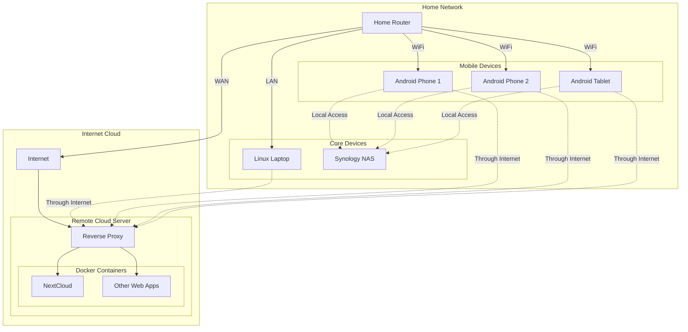

+++ 
draft = true
date = 2025-01-20T00:20:16+08:00
title = "Simplifying Home Network Security with Tailscale: A Journey from Port Forwarding to Zero Trust"
description = ""
slug = "trying-tailscale"
tags = []
categories = []
+++

## Introduction

I once gave Claude my entire Mastodon posting history and asked it for comments. It said, among others, that there were "Many threads about technical troubleshooting that end unresolved, which may frustrate followers." I read it as "you complain about your networking problems excessively", even on Christmas eve.[^1] 


Like many tech enthusiasts, I've spent years building and maintaining my home network. It started simple. A decent home router with some devices like laptops. Then a NAS. A repurposed computer serves web apps through docker for many years before being moved to the cloud. Then suddenly everybody started owning mobile devices. Nextcloud become a "good enough" and private alternative. Now everyone wants to access resources on my home network, both at home and outside of home. 

I think this setup is fairly typical in a modern household. Unfortunately, you need to manage several layers of configuration and security:
* Configure and maintain the reverse proxy (like Nginx or Traefik) for the Cloud Server
* Configure Docker and maintain container configurations
* Manage SSL certificates and their renewal
* Set up and maintain port forwarding rules for NAS access
* Manage DNS settings
* Configure network shares and permissions for file sharing and accounts
* Manage different URLs/IPs for local vs remote access

We spend lots of money on our equipment and there are lots of applications, both practical and fun, which increases the bang for our buck. In order to maximise our dollars, we also need to expend time and effort to ensure our IT infrastructure can support this, including from a security perspective. 

## Enter Tailscale

I had known about Tailscale for quite some time because I was checking out something related -- WireGuard. Back then I was trying to improve my Pi-Hole. It was cool to be able to connect your phone easily to your home network even when you're not physically there, but it was too much of a hassle. I lost interest shortly thereafter.

Things took a turn for the worse when I left on a holiday in Izu without my laptop (digital detox?). 

My Nextcloud server had crapped on itself while trying to update, and it had done this over several days so that I had no idea where was a good start. With some help from the fediverse, I managed to get terminal access through my iPad, but I had no ideas how to fix it while holidaying. Coming back, I still had no inspiration.[^2]

It felt like a good time to try something new. So I decied to install tailscale everywhere to see what will happen.

## My Tailscale Installation Journey
After deciding to try Tailscale, I started with what seemed like the easiest devices first. This turned out to be a good strategy, as it helped me understand the basics before tackling more complex setups.

## Mobile Devices and PCs: The Easy Start
Getting started was surprisingly straightforward. After creating a Tailscale account, the process was as simple as:

* Download the appropriate app for your device (Play Store for Android, official website for PC)
* Log in with your Tailscale account
* Accept the connection request

What impressed me was the immediate result - Tailscale automatically assigned each device an IP address and a hostname on my new private network. No manual configuration needed. Suddenly, my phone could reach my laptop using either the IP or hostname, regardless of which network either device was on.

## Synology NAS: Where Tailscale Really Shines
Installing Tailscale on my Synology NAS was refreshingly simple thanks to the package being available directly in the Synology Package Center. But the real magic became apparent after the installation.

I had previously tried Synology's QuickConnect for remote access, but found it limiting because it only works within the Synology ecosystem. Tailscale, on the other hand, opened up a whole new world of possibilities. Having low-level access through IP and hostname means I can:

* Access the NAS through any protocol I choose:
  * Standard web browser access for DSM interface
  * NFS for Linux systems
  * SSHFS for secure file system mounting
  * Direct port access for database connections
* Mount network drives directly on my devices
* Access services running on specific ports without any port forwarding
* Use standard Linux networking tools and protocols

This flexibility is game-changing. Instead of being confined to Synology's tools, I can now interact with my NAS as if it were a local network device, regardless of where I am. Need to connect to a MariaDB database running on the NAS? Just use the Tailscale IP and port. Want to mount a share on your Linux laptop? NFS is now accessible wherever you are.

## Cloud Server: The Final Piece

I knew that as I moved up my server chain, things will start to get dicey.

In order to get Tailscale to play nice with my Nextcloud AIO, I had to do something I never did in docker before. I had to ["link" my Tailscale container to my Nextcloud container](https://tailscale.com/blog/docker-tailscale-guide#service-linking). This worked like Tailscale was shadowing my Nextcloud, and allowed Nextcloud to operate within the Tailscale network. Now only clients connected to my Tailscale Network were able to connect to my Nextcloud instance, including Talk and other features.

So, once you get the authentication[^3] and sidecar linking working, you can get Tailscale to play with your docker container. It is a lot more involved than installing an app, but still pretty manageable if you've already been working with docker containers regularly. It is kinda weird to create individual Tailscale containers for each service, but they're all docker containers, so it ain't a big deal right?

Another problem which I foresee is a mix between private and public services. For example, there's a web server you want to allow the public to see, but you would like to keep the database and other services connected to the seb server to be private in a VPN. It's actually a happy problem to have -- I haven't found a set up which absolutely requires this configuration. 

## Conclusion: Tailscale is for the modern cloud

In the past, a home network was a "home" network. Physically, devices were behind a router, so you would always know where home is. However, a modern network, and increasingly the one I find in my home, has a more textured infrastructure consisting of cloud devices and mobile devices which sometimes are at home, and sometimes not at home. The abstraction that Tailscale provides makes the obvious straightforward, and I would recommend you to try it. I now keep my VPN on all the time. It's like a piece of home that stays close to me. 

[^1]: After I requested Claude to clarify its remark (read: put up or shut up), it apologised for "this inaccurate observation." (In the particular example, I did come back to share that I got it to work, several days later.)  

[^2]: There's a good argument that there wasn't anything I could do while I was in Izu. However, I needed to ensure my photos were being backed up in the cloud via NextCloaud. On hindsight, trying to maintain an operation while fixing a problem may have ruined both objectives. 

[^3]: The authentication aspect might be quite challenging as well, as you need to create OAuth keys and tags for containers. The [original link](https://tailscale.com/blog/docker-tailscale-guide) provides a good walkthrough on how to do that too.