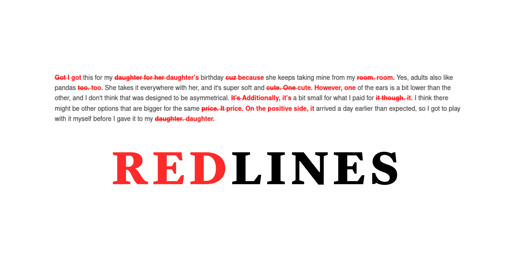

+++ 
date = 2024-09-05T11:41:15+08:00
title = "Redlines"
image = "repository-open-graph.png"
description = "Show the differences between two strings/text as a compact text, in markdown/HTML, in the terminal and more. "
+++

`Redlines` produces a Markdown text showing the differences between two strings/text. The changes are represented with strike-throughs and underlines, which looks similar to Microsoft Word's track changes. This method of showing changes is more familiar to lawyers and is more compact for long series of characters.

Redlines uses `SequenceMatcher` to find differences between words used.





I gave a talk on it too!



Check out the presentation here too:


